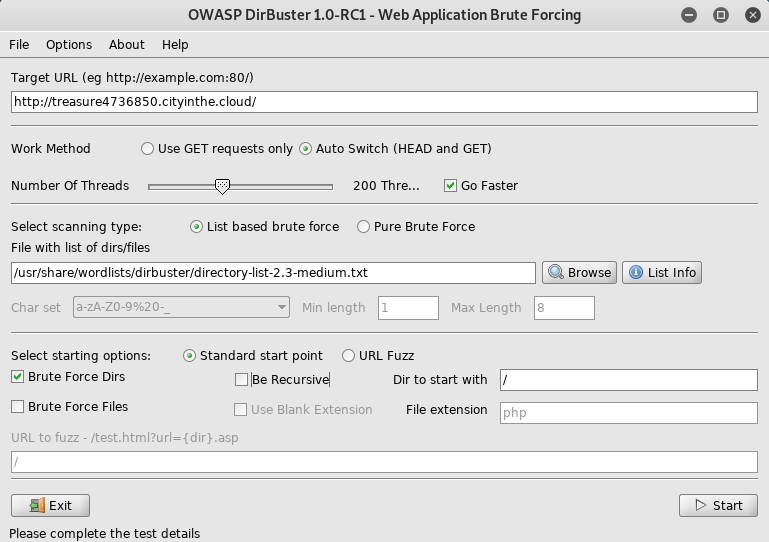

# Hidden Treasure (Medium)
## Test your scanning abilities. Find the hidden treasure on this HTTP [website](http://treasure4736850.cityinthe.cloud/).

### Note: You are allowed to run automated tools on this target.

-	What is the first flag?
-	What is the second flag?
-	What is the third flag?
-	What is the fourth flag?
-	What is the fifth flag?

---

We will using DirBuster to find all of the subdirectories. The first through the fourth flag could be found using the settings given in the image below.

`$ dirbuster`

###	What is the first flag?
###	What is the second flag?
###	What is the third flag?
###	What is the fourth flag?
###	What is the fifth flag?
Wasn't able to find this one.

