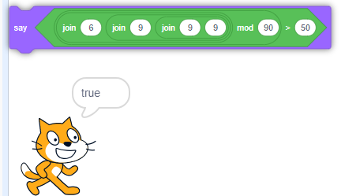

# Script Kiddie (Medium)
## We've identified script kiddie that has developed a program to validate flags, but we have no idea how to execute this binary.

-	What is the file format of the script_kiddie binary?
-	What language is the program written in?
-	What is a valid flag for the program?

---

###	What is the file format of the script_kiddie binary?
We have a few options here. Since the binary is pretty small, I just uploaded it to CyberChef and saw that the file signature was PK ([which means it's a .zip file](https://en.wikipedia.org/wiki/List_of_file_signatures)). I appended `.zip` to the file and unzipped it with WinRAR. Once unzipped, I found some interesting files.
```
83a9787d4cb6f3b7632b4ddfebf74367.wav
83c36d806dc92327b9e7049a565c6bff.wav
b7853f557e4426412e64bb3da6531a99.svg
cd21514d0531fdffb22204e0ec5ed84a.svg
e6ddc55a6ddd9cc9d84fe0b4c21e016f.svg
project.json
```
After opening up some of the images, I found that it was a picture of the [Scratch](https://scratch.mit.edu/) mascot. Scratch is a visual programming language developed by MIT. <br>


It's somewhat common for uniq extensions to just be using a compressed archive. That means that we should be able to open the file in Scratch with the correct file extension. I looked up the [Scratch file format](https://en.scratch-wiki.info/wiki/Scratch_File_Format) and found that the extension should be `.sb3`.

File Format: `sb3`
###	What language is the program written in?
We know from the previous research that the file is written in `Scratch`

###	What is a valid flag for the program?
Here is the code that we are interested in:


We can pretty easily tell that the flag begins with `SKY-FLAG-`. The last line looks like it could be variable and not a specific number. I went ahead and just recreated the last bit of logic and played around with the numbers. We find that the combination of 6999 mod 90 is greater than 50. <br>


We put it all together and create a valid flag: `SKY-FLAG-6999`