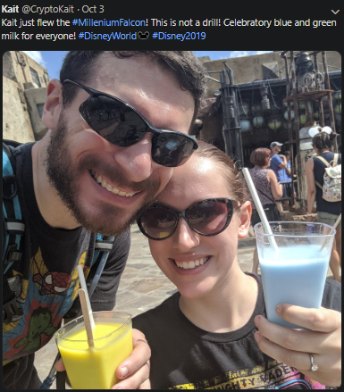
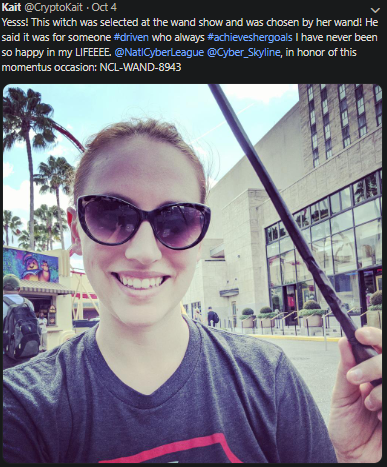

# CryptoKait (Hard)
## NCL Chief Player Ambassador, CryptoKait, found some flags while she was on her trip to Orlando. Find some of the flags she shared on Twitter and answer questions about her trip. 

-	What drink did Kait have at Galaxy's Edge (include the color)?
-	What was the name of the Droid best friend that Kait met at Disney?
-	What did Kait name the droid she built at Disney World?
-	What scheme was used to encode a message that Kaitlyn found at Galaxy's Edge?
-	What is the plaintext of the encoded message that Kait found at Galaxy's Edge?
-	What flag did Kait share after she was chosen at the wand ceremony?
-	What flag did Kait share before she took her flight back from Orlando?

---

## All answers can be found on her Twitter [page](https://29a.ch/photo-forensics/).

### 	What drink did Kait have at Galaxy's Edge (include the color)?

`Blue Milk`
### 	What was the name of the Droid best friend that Kait met at Disney?

`R3n1`

### 	What did Kait name the droid she built at Disney World?

`BB-K8`

### 	What scheme was used to encode a message that Kaitlyn found at Galaxy's Edge?
Galexy's Edge is a Star Wars theamed part of Disney World. Simply looking up 'Star Wars alphabet' gave us [this](https://www.omniglot.com/conscripts/aurekbesh.htm) website. 

`Aurebesh`

### 	What is the plaintext of the encoded message that Kait found at Galaxy's Edge?

Deciphering the message using the table below gave us our encoded message.

`DANGER KEEP CLEAR`

### 	What flag did Kait share after she was chosen at the wand ceremony?

`NCL-WAND-8943`

### 	What flag did Kait share before she took her flight back from Orlando?

`NCL-BUZZ-4816`